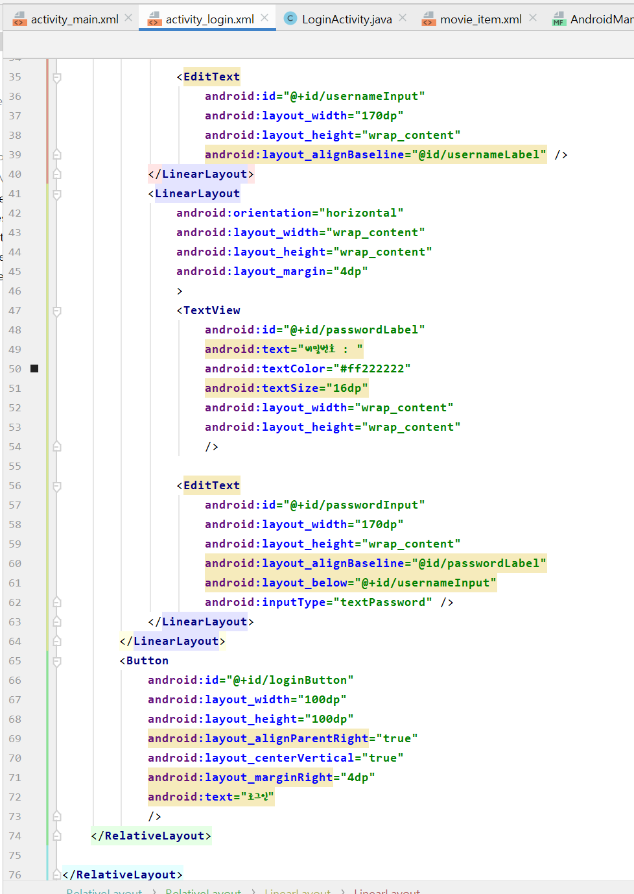
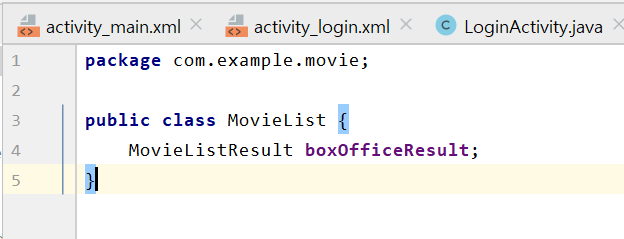

19273035 정현수

## MyFirstRepository

</img>

## 2주차 과제
</img>
</img>

## 3주차 과제
</img>
</img>
</img>

## 4주차 과제
  예를 들어 'CJ one' 어플은 CJ 기업에 해당하는 여러 계열들을 한 눈에 볼 수 있도록 모아둔 어플리케이션이다. 해당 계열들의 온라인 영수증, 적립, 포인트, 행사 등을 한 번에 볼 수 있어 매우 편리하고 효과적이기 때문에 많은 소비자층에 호감을 사고있다. 비슷한 예시로는 현대, SSG 등등 어플리케이션들이 있다. 이러한 비슷한 방식으로, '전국에 있는 카페들을 한 눈에 볼 수 있게 해주는 어플이 있으면 어떨까' 라는 생각을 했다. 카페 관련 사업자들은 전부 해당 어플에 사업자등록을 하여, 모든 소비자들이 하나의 어플리케이션에서 전국의 모든 카페들을 적립하고, 행사 소식을 알 수 있도록 하면 여러 기업의 어플, 여러 카페 관련 어플을 깔지 않더라도 한 어플에서 쉽게 관리할 수 있는 어플을 만들 계획이다......... ......

## 7주차 과제
</img>
</img>
</img>

## 9주차 과제
</img>
</img>
*main1
</img>
*main2
</img>

## 10주차 과제
*ac
*1
</img>
*2
</img>
*ma
*1
</img>
*2
</img>

## 11주차 과제
*actmain
</img>
*mainact
</img>
*menu
</img>
*android
</img>

## 10주차 에러 수정
</img>
*detail
</img>
*detail1
</img>

## 11주차 에러 수정
</img>
*detail
</img>
*phone
</img>
</img>

## 12주차 과제
*ac
</img>
*ma
</img>
</img>
*build
</img>
*and
</img>
*phone
</img>
</img>

# 기말 및 졸작

## 13주차 과제
* 13am
</img>
* 13ma
</img>
</img>
* movie
</img>
* movielist
</img>
* movieresult
</img>
* build
</img>
* and
</img>
*최종
</img>

## login
</img>
* am
</img>
* 15acm
</img>
* 15acl1
</img>
</img>
* 15la
</img>
* 15mi1
</img>
</img>
* 15build
</img>
* 15movie
</img>
* 15movieresult
</img>
* 15 movieadapter
</img>
</img>
* 15movielist
</img>
* 15movielistresult
</img>

## call
</img>

## moviemoive
</img>
